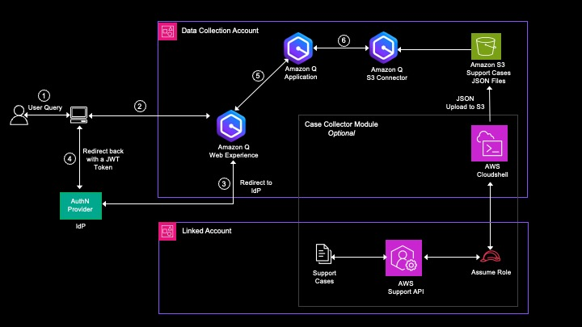

# Q Case Insights (QCI)


This sample solution, Q Case Insights (QCI), enables analytics with Generative AI on your past or existing AWS Support Cases to derive meaningful insights based on common patterns, issues, and resolutions. [Amazon Q Business](https://docs.aws.amazon.com/amazonq/latest/business-use-dg/what-is.html) is a fully-managed, generative-AI enterprise chat assistant for natural language queries and question-answering capabilities. QCI presents the capabilities of Q Web Experience with Generative AI, providing the ability for comprehensive sentiment analysis, trend detection, root cause analysis, and predictive modeling on your AWS support cases. 

QCI can also get support cases across your chosen accounts using the [AWS Support API](https://boto3.amazonaws.com/v1/documentation/api/latest/reference/services/support.html). The native capabilities of Amazon Q Business are utilized to index the AWS support case data from Amazon S3 and provide a chatbot web experience.

QCI consists of following modules:

* Amazon Q Business Application and Web Experience module (web experience to provide support case analytics with chatbot, conversational and interactive user experience)
* Amazon Q Case Collector Module - Optional (This module is optional. Using a central account, build resources to collect all existing support cases across from each of the member accounts with a given time interval and upload it to S3.)
* For collecting an updated or a new support case please refer https://github.com/aws-samples/case-insights-for-multi-accounts/

Leveraging Amazon Q with your support case data provides several opportunities such as finding the top issues, the top root causes and resolutions, review and update internal documentation and practices based on AWS best practices, or even summarize issues to shorten time to resolution for new issues.

# Prerequisites

it is recommended to use [AWS CloudShell](https://docs.aws.amazon.com/cloudshell/latest/userguide/welcome.html) as you will have AWS CLI configured and Boto3 Python Library installed. 
If you are not using AWS CloudShell, the pre-requisites are:
* AWS CLI installed and configured with appropriate permissions.
* Boto3 Python library installed.
* Access to AWS CloudFormation and permissions to create StackSets and stacks.
* S3 bucket for storing support case data.
* S3 bucket for storing Q Application deployment resources.


# Solution Architecture

The following diagram illustrates a multi-account structure. 



The DataCollection Account refers to the central account that contains the support cases in a S3 bucket after downloading from the all accounts in scope. The Linked accounts refer to any accounts other than the DataCollection Account, that have AWS support cases. 


# Deployment

## Amazon Q Business Components

Note: At this time, Amazon Q Business is only available in us-west-2 and us-east-1. Please select one of these regions to continue.

In this section, we will go through the steps to set up Amazon Q components 

**a. Create Amazon Q Application and Web Experience**
* Login to your AWS account and launch AWS CloudShell.
* Clone the repository using the command:

```bash
git clone https://github.com/aws-samples/support-case-insights-with-amazon-q.git
```

* Navigate to the support-case-insights-with-amazon-q/src directory, and run the setup script to create the Amazon Q application.

```bash
cd support-case-insights-with-amazon-q/src
./deploy_cfn.sh <name of bucket that will hold deployment resources> <name of the bucket that contains the case data>
ie: ./deploy_cfn.sh my-bucket-for-q-lambda-app my-bucket-for-q-datasource
```
This script will create resources required for setting up Amazon Q Application using a CloudFormation template. This includes a Lambda function that creates Amazon Q Business Data Source and another Lambda function that creates the Amazon Q Business Application and Web Experience. It also creates required IAM role for Amazon Q application.

**To use the data in the Q Application, you need to synchronize the Q Datasource.**
The data source created above is scheduled to synchronize the support case data every day at midnight UTC.

If you already have support case data in the bucket, you can start [synchronizing](https://docs.aws.amazon.com/amazonq/latest/business-use-dg/supported-connectors.html) AWS Support data from your Amazon S3 bucket into one container index. This step might take minutes to hours depending on the number of support cases stored in the Amazon S3 bucket.
To synchronize the Q datasource:
* Go to the Amazon Q console and select your Q application that starts with prefix "support-q-app-".
* Select the datasource "support-q-data-source-" and click **Sync now**.

At this stage, the Amazon Q Application with web experience is created. While you can preview the end-user web experience to verify readiness to deploy, the web experience is not yet deployed. For the web deployment, please follow the instructions in the next section below. 


**b. Deploy the Web Experience** 

Amazon Q requires that you integrate your web experience with an identity provider (IdP) that is compliant with SAML 2.0. Some examples of IdPs are AWS IAM Identity Center, Okta, and Microsoft EntraID. For more information please refer [Deploying an Amazon Q web experience](https://docs.aws.amazon.com/amazonq/latest/business-use-dg/deploy-experience.html)

To deploy the web experience, below are the steps:
* Go to the Amazon Q console and select your Q application that starts with prefix "support-q-app-".
* Go to Web Experience Settings and click Edit.
* Select the service role for your web experience or create a new one.
* In the “Provide metadata from your IdP” Click on “Import from XML file” to import your IdP metadata file. 
* In “Configure user and group mapping” enter the “Email attribute of SAML assertion” field.
* Click Deploy. It will deploy the web experience. You will see the Deployed URL in the application under Web Experience Settings tab.

**c. Try the Amazon Q Web Experience**
1. Navigate to the Q application in your AWS console.
2. Select the application with prefix "support-q-app-".
3. In the Data sources, check the *Current sync state* status. If it states *Syncing*, you will have to wait until it is completed. Proceed to the next step if completed. 
4. Click *Preview Q Web Experience* in the application to view in preview mode. 
5. Or click on *Deployed URL* under *Web experience settings* to launch the deployed web experience.
6. Type your query (e.g. Top RDS issues?) and it should return a response after a few seconds.


## Case Collector Setup - Optional Steps
If you already have support cases stored in an S3 bucket in JSON, TXT, or HTML format, you may skip this section. 
Otherwise, the steps below performs IAM roles creation in both the DataCollection and Linked accounts and use the [AWS Support API](https://boto3.amazonaws.com/v1/documentation/api/latest/reference/services/support.html) to get the list of support cases in JSON-formatted objects. 

### Case Collector Resources - Deployment
**Option 1:** Using setup script leveraging [AWS Organizations](https://docs.aws.amazon.com/organizations/latest/userguide/orgs_introduction.html) - Bulk deployment via StackSet. Use this option if you have AWS Organizations setup. You can leverage [AWS CloudFormation StackSets](https://docs.aws.amazon.com/AWSCloudFormation/latest/UserGuide/what-is-cfnstacksets.html) across multiple linked or member accounts with a single operation. AWS Organizations integrates with CloudFormation and helps you centrally manage as you scale to multiple accounts. 

1.	Launch AWS CloudShell and clone the QCI repository from GitHub using the command:

```bash
git clone https://github.com/aws-samples/support-case-insights-with-amazon-q.git
```

2.	Navigate to the q-support-case-insights directory, and run the setup script.

```bash
cd support-case-insights-with-amazon-q/src/case_collector
python3 deploy_infrastructure.py
```

**Option 2:** Manual Deployment in each account via CloudFormation.
Use this option if you don't have [AWS Organizations](https://docs.aws.amazon.com/organizations/latest/userguide/orgs_introduction.html) setup and you do not have mutiple accounts. You will have to login to each member or linked account to run the CloudFormation template.

**Linked Account Deployment**
You will need to create necessary roles in each linked or member account for accessing AWS Support API.
1.	Login to AWS Linked account and navigate to the AWS CloudFormation console. 
2.	Download the linked account template [member-account-template.yaml](https://github.com/aws-samples/support-case-insights-with-amazon-q/blob/main/src/case_collector/member_accounts_resources.yaml).
3.	Create an AWS CloudFormation Stack with the downloaded template.
4.	Provide the inputs.
5.	Submit.

**DataCollection Account Deployment**
The CloudFormation will create necessary resources in DataCollection for accessing AWS Support API in Linked Accounts and uploading JSON response to S3.
1.	In Data Collection account, login and navigate to the AWS CloudFormation console. 
2.	Download the link account template [member-account-template.yaml](https://github.com/aws-samples/support-case-insights-with-amazon-q/blob/main/src/case_collector/central_account_resources.yaml).
3.	Create an AWS CloudFormation Stack with the downloaded template.
4.	Provide the inputs.
5.	Submit.


### Historical Cases Upload to S3
Now that you have IAM role setup to get support cases across your selected accounts using the AWS Support API, you can run the script as indicated below to upload the support cases in JSON format to your Data Collection S3 bucket.

Run the upload cases script:
```
python bulk_upload_cases.py <name of the bucket in the DataCollection account that contains the case data>
```

This script assumes roles in member accounts, collects existing support cases, and uploads them to the designated Amazon S3 bucket. 


## Cleanup
To clean up the environment you have setup:
1. Delete the Q Application: delete the corresponding Cloudformation Stack.
2. Empty and delete the two S3 buckets:
   * S3 bucket that contains the support case data.
   * S3 bucket that contains Q Application deployment resources.
3. Delete the case collector resources: depending on the option you have selected for deployment, delete the Stackset or delete the IAM roles and corresponding Cloudformation stack.
