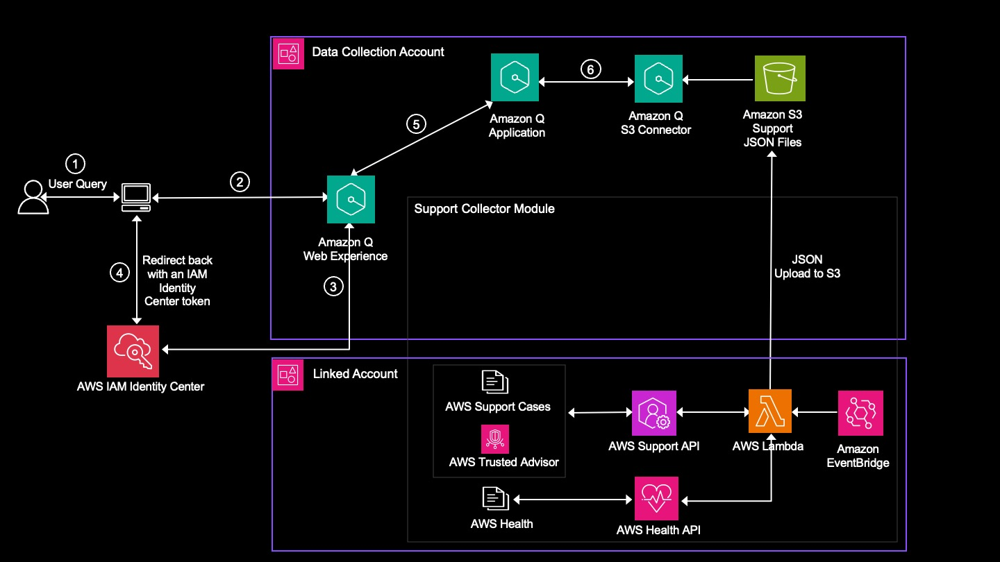

# Amazon Q Support Insights (QSI)

This solution, Amazon Q Support Insights (QSI), harnesses Generative AI leveraging Amazon Q Business to provide insights and recommendations on AWS support data, enabling proactive planning, advisory services, automation capabilities, and cloud expertise that help you accelerate business outcomes and scale operations in the cloud. [Amazon Q Business](https://docs.aws.amazon.com/amazonq/latest/business-use-dg/what-is.html) is a fully-managed, generative-AI enterprise chat assistant for natural language queries and question-answering capabilities. QSI presents the capabilities of Q Business with Generative AI, providing the ability to leverage insights from past support cases to get answers specific to your environment's incidents, analyze Trusted Advisor recommendations for guidance on provisioning resources following AWS best practices, gain visibility into resource performance and service availability through AWS Health data, enabling to make informed decisions that improve operational efficiency. 

QSI retrieves support cases, Trusted Advisor, and Health data across your chosen accounts using the [AWS Support API](https://boto3.amazonaws.com/v1/documentation/api/latest/reference/services/support.html) and [AWS Health API](https://boto3.amazonaws.com/v1/documentation/api/latest/reference/services/health.html). The native capabilities of Amazon Q Business are utilized to index the AWS support and Health data from Amazon S3 and provide a chatbot web experience.

QSI consists of following modules:

* Amazon Q Business Application and Web Experience module (web experience to provide support insights with chatbot, conversational and interactive user experience)
* Amazon Q Support Collector Module - Using a central account, build resources to collect all existing support cases, Trusted Advisor, and Health data across from each of the member accounts with a given time interval and upload it to S3.

# Prerequisites

It is recommended to use [AWS CloudShell](https://docs.aws.amazon.com/cloudshell/latest/userguide/welcome.html) as you will have AWS CLI configured and Boto3 Python Library installed. 
If you are not using AWS CloudShell, the pre-requisites are:
* AWS CLI installed and configured with appropriate permissions.
* Boto3 Python library installed.
* Access to AWS CloudFormation and permissions to create StackSets and stacks.
* An Amazon S3 bucket for storing support data.
* An Amazon S3 bucket for storing Q Application deployment resources.

# Solution Architecture

The following diagram illustrates a multi-account structure. 

The DataCollection Account refers to the central account that contains the support data in a S3 bucket after downloading from the all accounts in scope. The Linked accounts refer to any accounts other than the DataCollection Account, that have AWS support data - AWS support cases, Trusted Advisor or Health. 

# Deployment
This section outlines the key steps required to set up and configure the various components of the QSI solution. This includes deploying the core Amazon Q Business application, as well as the supporting infrastructure to collect and process the necessary AWS support data.

## Amazon Q Business Components

The Amazon Q Business application has the Q web interface and application for the QSI solution, providing the natural language processing, knowledge base, and conversational interface capabilities. 

The deployment process for these Q Business components is detailed in the [Q Support Insights (QSI) - Amazon Q Business Deployment](./src/q_application/README.md) guide, located in the `src/q_application` subdirectory. This guide covers the steps to set up the required AWS resources, to enable the Q Business application.

## AWS Support Collector Module 

The QSI solution includes a data collection module to retrieve the necessary AWS support data. 

The [Q Support Insights (QSI) - AWS Support Collection Deployment](./src/support_collector/README.md) guide, located in the `src/support_collector` subdirectory, outlines the steps to deploy the AWS Lambda functions and other resources required to collect and upload AWS Support Cases, Health Events, and Trusted Advisor data to an Amazon S3 bucket. This collected data can then be leveraged by the Q Business application to provide insights and recommendations.

## Disclaimer
The sample code provided in this solution is for educational purposes only and users should thoroughly test and validate the solution before deploying it in a production environment.
