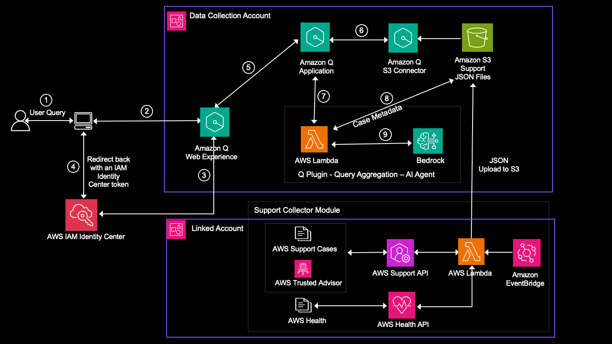

# Amazon Q Business with Query Aggregation Custom Plugin

## Solution Overview

This solution extends Amazon Q Business with custom plugins to enable precise analytical querying of AWS Support cases and Health events.
 While the RAG capabilty of Q Business provides powerful semantic search capabilities (like "tell me about case XYZ"), the custom plugins add structured analytics support (like "count of high-severity cases") through Athena SQL queries. The solution's custom plugins convert natural language queries into Athena SQL to provide accurate metrics and correlations. This combines the best of semantic search with structured data analysis in one conversational interface.

### Prerequisites

1. It is recommended to utilize AWS CloudShell, as it comes pre-installed with the required libraries and tools. Alternatively, you can use a local machine with the AWS CLI installed and configured with valid credentials.
2. Two S3 buckets:
   * Support Data Bucket - for storing AWS Support case data
   * Resource Bucket - temporary for storing Lambda resources for deployment (can be deleted after deployment)
3. IAM Identity Center instance configured
4. The solution needs AWS Support data collected via the [Support Data Pipeline](https://github.com/aws-samples/support-insights-with-amazon-q/tree/main/src/support_collector). You can deploy now and add data later, but functionality depends on data availability in your S3 bucket.
5. Access to Bedrock Model - Claude-3-5-Sonnet. Refer [Bedrock guide to Access foundation models](https://docs.aws.amazon.com/bedrock/latest/userguide/model-access-modify.html)
6. 'default' database should  exist in Athena. If not, you can create one using Athena Query Editor
```bash
create database default
```

### Deployment Steps
One script deploys the Q solution. No manual steps needed - the script handles all stack creation and configuration automatically.

**Run the deployment script:**
```bash
# Clone the repository
cd q_application
chmod +x deploy_q_stacks.sh
./deploy_q_stacks.sh
```
 (takes about ~5-7 minutes to deploy)

**Note: You'll need to provide:**

1. IAM Identity Center ARN
Format: arn:aws:sso:::instance/ssoins-xxxxxxxxxxxxxxxxx
Find it: IAM Identity Center console > Settings > Instance ARN

2. S3 Bucket Names
- Support Data Bucket: Your central bucket containing AWS Support cases, Health events, and Trusted Advisor data. This is where your data pipeline stores the support data
- Resource Bucket: Temprary Bucket for storing Athena query results and Lambda resources

After deployment, synchronize the data source, assign access to users and groups, and use the deployed web experience URL to interact with the Amazon Q Business application.

### Synchronize The Data Source
For synchronizing the data source, please ensure the support data exists in S3 bucket. If not, please refer section - Data Pipeline and Synchronization, for more details.

The document sync mode is set to '*New, modified, or deleted content Sync*' Therefore after the application is created it should start indexing. You can verify the indexing status as below.
1. In Applications, select 'qsi-app' application.
2. On the application page, from Data sources, select the S3 data source 'qsi-insights-datasource'
3. The console should display a message confirming that your sync job has started successfully. If not, you can manually trigger the sync by clicking on  '*Sync now*'. 
4. This might take from few minutes to hours depending on the volume of the dataset.
5. While sync is happening, proceed with next steps as indicated below.

### Add Groups and Users Access

1. Login to AWS Account where script was executed and navigate to the Amazon Q console and select your Q application with name that was provided in previous step.
2. Navigate to **Groups and users** and click on **Add Groups and users**, select **Assign existing users and groups**, click **Next** and click **Get Started**.
3. In the Assign users and groups window, use the search box to find users and groups by name. Click **Assign** to add the group/users to the application.
4. Selected the newly added user/group, click **Choose Subscription**, select **Q Business Pro/Q Business Lite**.

### Use Web Experience

1. Login to AWS Account where script was executed and navigate to the Amazon Q console and select your Q application with name that was provided in above Step.
2. In the Data sources, check the current sync state status. If the status is "Syncing", you will have to wait until it is completed.
3. Click on deployed URL under Web experience settings to launch the deployed web experience.
4. Type your query and it should return a response after a few seconds.


#### Q Plugin Verification

1. In the Amazon Q Business console, verify both plugins appear in your application
   - HealthQueryAssistant
   - CaseQueryAssistant
2. Test the Health Query plugin with a sample query like: "Show me health events for September 19, 2024"
3. Test the Case Query plugin with a sample query like: "Show me high severity cases from January 2024"


### Architecture Flow
The following diagram illustrates a multi-account structure.




1. The custom plugin detects the analytical intent and triggers a Lambda function
2. The Lambda function uses Bedrock LLM to transform the natural language query into precise Athena SQL
3. The query executes against structured metadata in Amazon Athena
4. Results are synthesized back into natural language and presented alongside traditional RAG responses


### Data Pipeline and Synchronization

The Q solution, including both RAG and custom plugins, requires AWS Support data to be present in it's data source (S3 bucket). This deployment does not install the data pipeline itself. To set up the necessary data pipeline:

1. Refer to the [Support Data Collector Guide](https://github.com/aws-samples/support-insights-with-amazon-q/tree/main/src/support_collector) for detailed implementation instructions.
2. Ensure your data pipeline is configured to populate the S3 bucket specified during this deployment.

Once set up, the data pipeline enables two synchronization mechanisms:

1. **Real-time Case Updates:** Processes AWS Support cases through event-based triggers (CreateCase, AddCommunicationToCase, ResolveCase, ReopenCase).
2. **Historical and Daily Sync:** Performs initial historical data sync and refreshes Trusted Advisor (TA) data daily.

These mechanisms ensure your Q application has access to up-to-date support data for both semantic search and analytical queries.


#### Security Note
This implementation uses a simple token-based authentication for demonstration purposes. For production environments, it's strongly recommended to use OAuth 2.0 authentication as documented in the [Amazon Q Business Plugin Authentication Guide](https://docs.aws.amazon.com/amazonq/latest/qbusiness-ug/confluence-cloud-credentials-oauth.html).

The current token-based approach is used for simplicity:
- Generates a random token during stack creation
- Requires manual token rotation
- Provides basic authentication only

#### Troubleshooting

If plugins don't appear or queries fail:
- Check CloudWatch Logs under `/aws/lambda/q-query-aggregation-assistant`
- Verify Bedrock - claude-3-5-sonnet Model access is enabled
- Verify S3 bucket permissions in IAM roles
- Ensure Athena database and tables exist with correct schemas

### Resources Created

The deployment creates Lambda function for query processing
      - API Gateway endpoint
      - Two Q Business plugins (Health and Case)
      - IAM roles and policies
      - Glue table definitions for health events and case metadata

1. **Support Case Metadata Management:**
   * Historical Export Function for existing cases
   * Real-time Update Function for new/updated cases
   * Automatic categorization of resolved and active cases

2. **Amazon Q Business Application:**
   * S3 Datasource Connector
   * Web Experience interface
   * Required IAM roles and permissions

3. **Custom Query Plugins:**
   * Health Query Assistant
   * Case Query Assistant
   * Athena integration for data querying


#### Resources Cleanup
To remove all resources, delete the CloudFormation stacks in the follwing order: 1/ case-metadata-stack. 2/ amazon-q-stack 3/ custom-plugin-stack.
Note that this won't delete the existing S3 buckets


